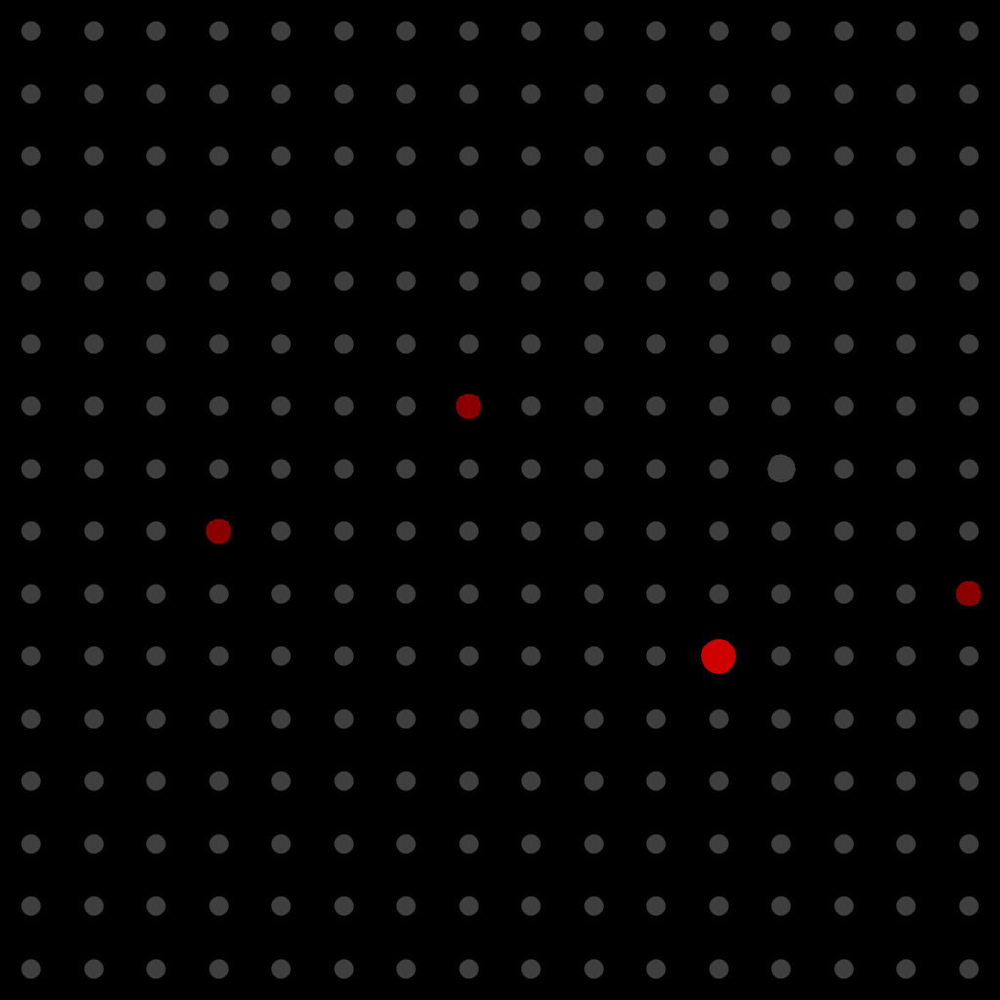

# SoundSquare
SoundSquare is a 16x16 pentatonic step sequencer. You have 8 instruments, 16 tones per instrument, and 16 steps at your fingertips!

## To Build
1. Install a midi server. I used [fluidsynth](http://www.fluidsynth.org/).
2. Install [openFrameworks](http://www.openframeworks.cc/) and the ofxMidi extension.
3. Point hw3 to your openFrameworks installation in `config.make`
4. Run `make`

## To Run
1. Run your midi server. For me, I run fluidsynth and point it to the correct sound card with: `fluidsynth --server --audio-driver=alsa -o audio.alsa.device=hw:1,0 /usr/share/sounds/sf2/FluidR3_GM.sf2`
2. Run `./bin/hw3`

## Design
Here are the sketches and notes I made while designing SoundSquare. SoundSquare is heavily inspired by [ToneMatrix](http://tonematrix.audiotool.com/)

## System design
I use midi for my sound output. This makes playing different instruments with different settings (like velocity, pitch, etc.) really easy. I get to focus on the design of my sequencer rather than the architecture.

Software-wise, I use a 2-d array of bitmaps to record which instruments are active at which pitches and steps. This allows me to use just 1 bit per combination of instrument, pitch, and step so it's quite efficient.

## More screenshots

